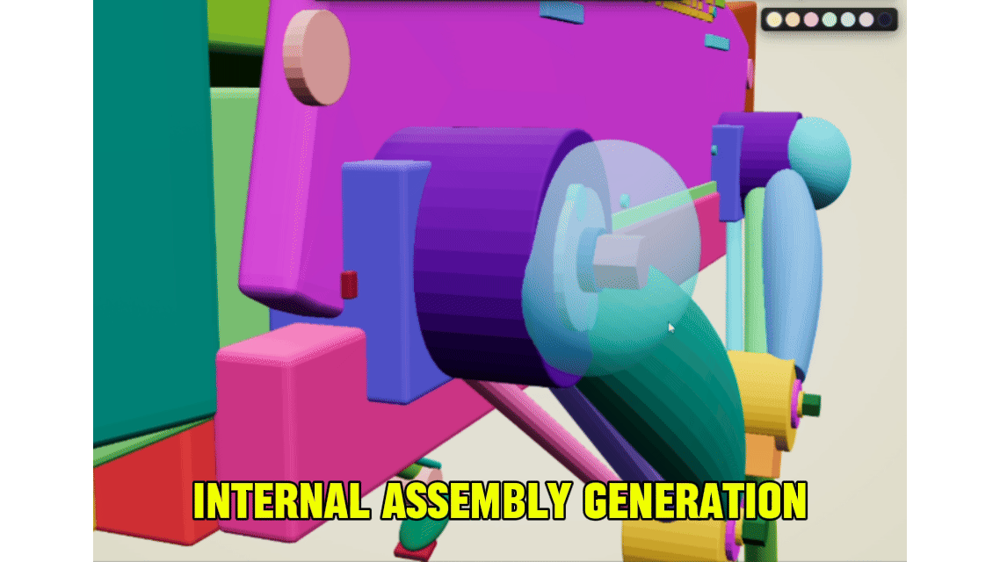
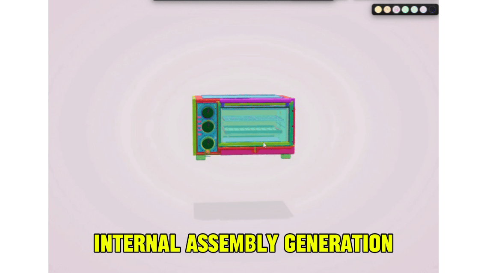
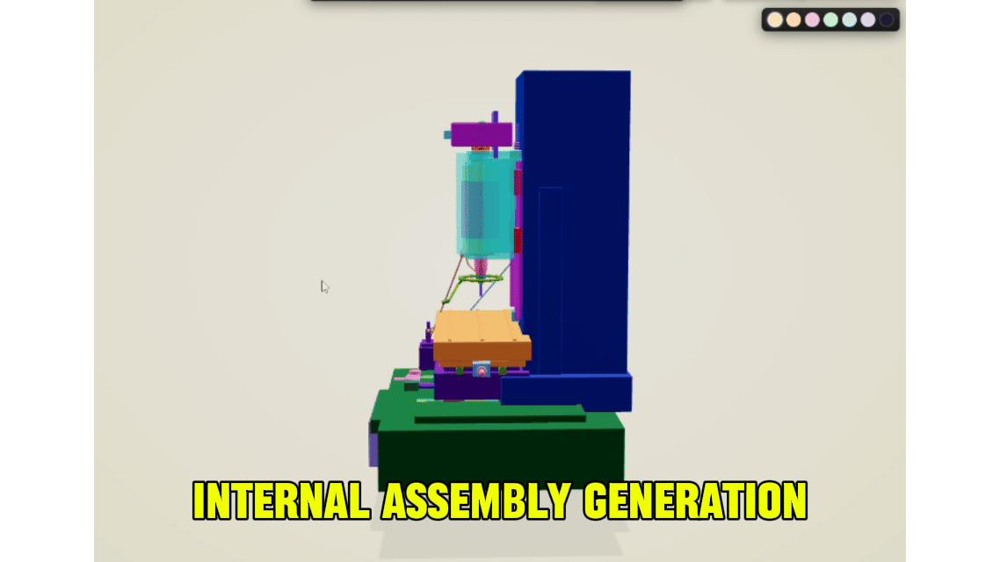
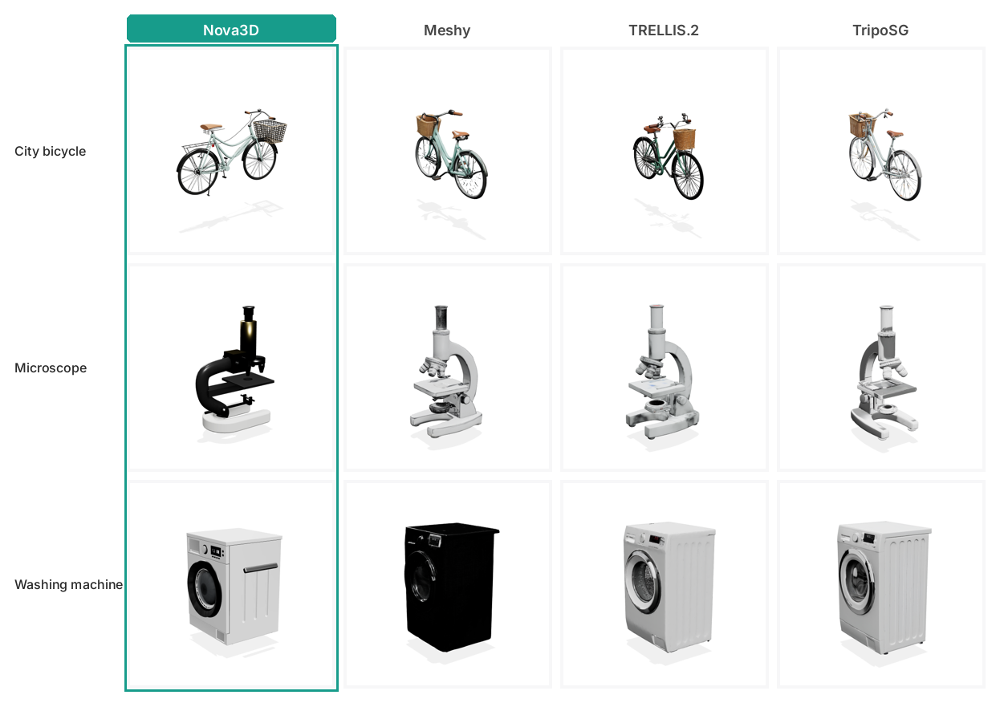
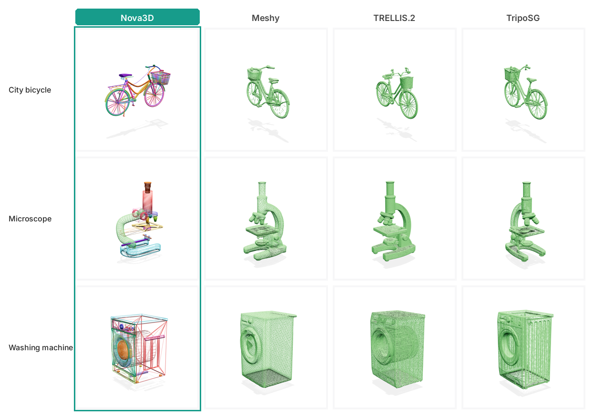
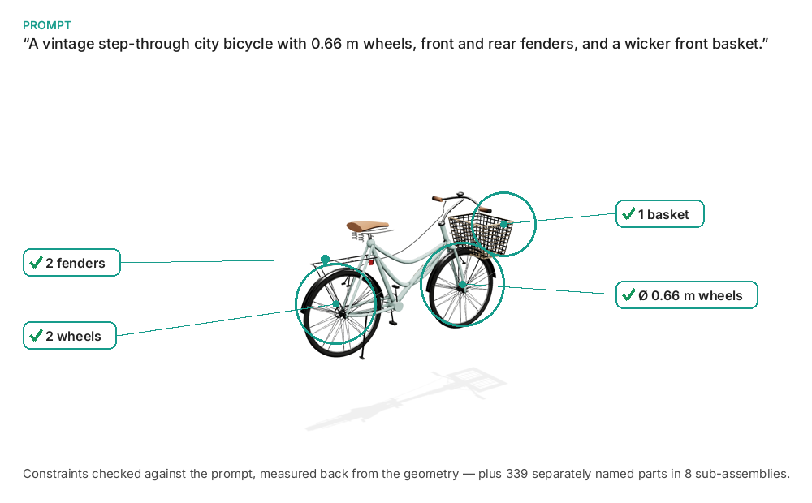
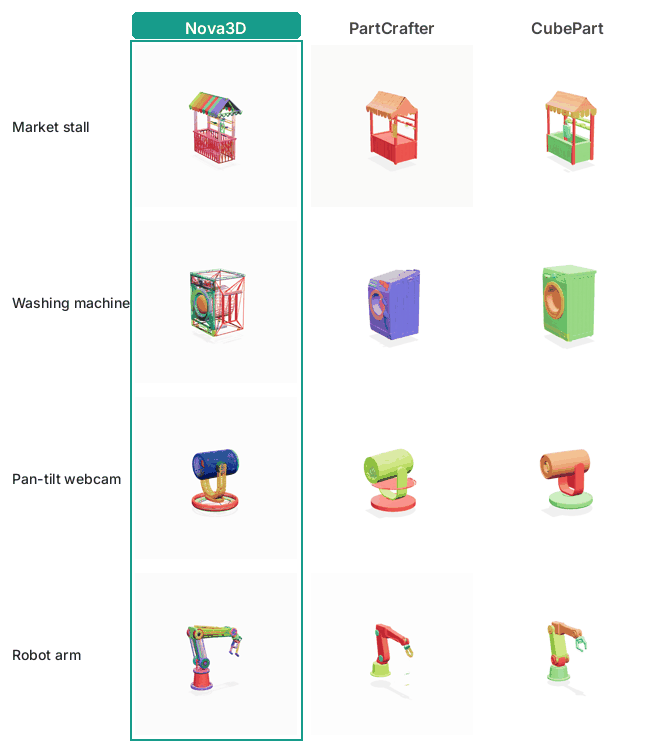
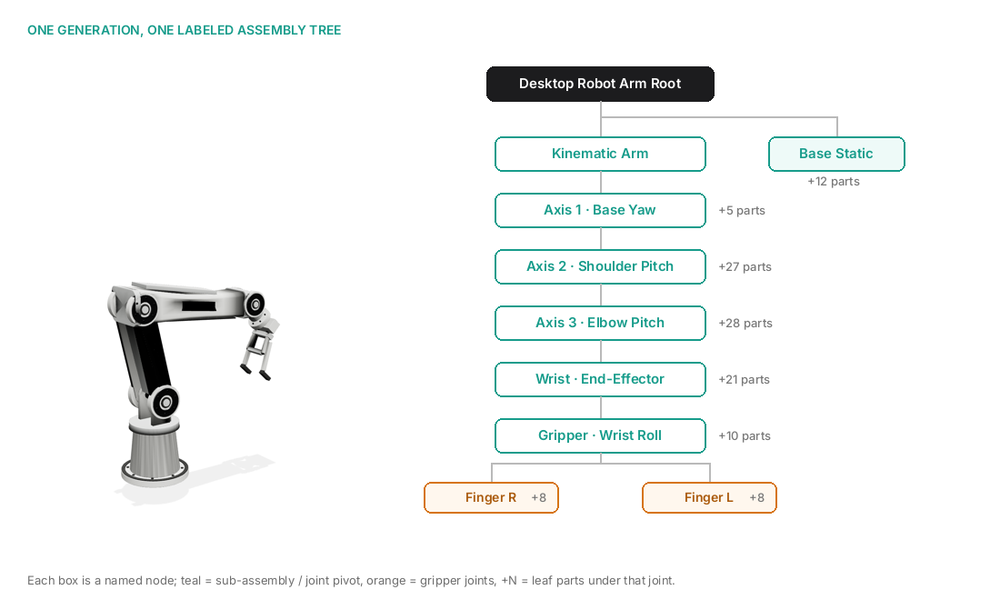
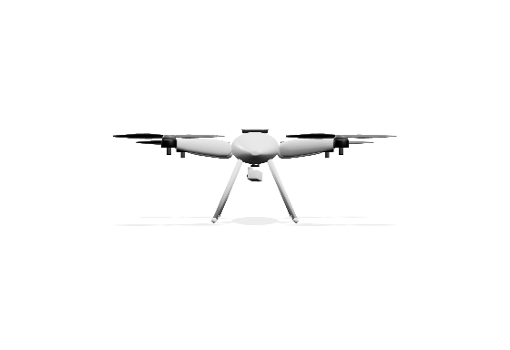
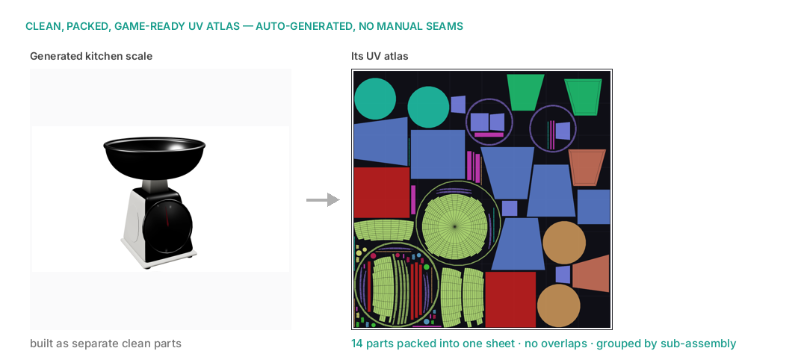

<div align="center">

# Nova3D

**Code-native 3D generation — assets are executable programs, not opaque meshes.**

[website](https://nova3d.xyz) · [app](https://app.nova3d.xyz) · [discord](https://discord.gg/QEH8mzcwdR) · [twitter/X](https://x.com/nova3d_ai) · [issues](https://github.com/RareSense/Nova3D/issues)

<br/>

&nbsp;&nbsp;

</div>

## What is Nova3D?

Nova3D generates 3D assets as **executable construction procedures**. Instead of emitting a single fused mesh, the pipeline writes Blender-native Python that compiles to a structured GLB with **named, separately addressable parts**, a real assembly hierarchy, joint pivots, and PBR materials.

The asset's source of truth is the program; the mesh is just its compiled output. Because anything coded is programmable, every generated object is born **inspectable, addressable, editable, and animatable** — properties a baked mesh cannot natively expose.

This is architecturally different from diffusion-based generators (Meshy, Tripo, Rodin), which extract a single merged mesh with no part boundaries, and from CSG/OpenSCAD systems, which guarantee solids but cap out on organic shapes, hierarchy, and materials. Nova3D uses Blender's scene graph as the native representation — a strict superset of both.


## Getting started

The web client lives in [`app/`](app/) and connects to the hosted Nova3D service — no local backend required. See **[`app/README.md`](app/README.md)** for prerequisites, setup, features, and troubleshooting.


## Repository structure

This repository is the home for Nova3D's open clients and integrations. The hosted generation backend is (currently) closed-source.

```
Nova3D/
├── app/              # Flutter/Dart web client  ·  see app/README.md
├── mcp/              # Nova3D MCP server (coming soon)
├── blender-plugin/   # Blender plugin (coming soon)
├── claude-skills/    # Claude skills (coming soon)
├── docs/             # architecture & the "3D as code" thesis (coming soon)
└── examples/         # gallery of generated assets + their source programs (coming soon)
```

> Surfaces are being moved in one at a time. Today the **client app** lives in [`app/`](app/).

## Demo

[](https://www.youtube.com/watch?v=rLzkfTzDdwY)

☝️ Prompt: *Make a washing machine with detailed internal mechanics*

## Comparison

[](https://www.youtube.com/watch?v=iL_NX_hBq9k)

☝️ Side-by-side with TRELLIS and Hunyuan3D. Nova3D is optimized for **structured asset generation**, but the advantage is not limited to multipart editing — it also shows stronger single-asset fidelity: cleaner silhouette control, sharper feature delineation, and more coherent surface transitions. **Explicit part structure is an added capability, not a quality tradeoff.**

[](https://www.youtube.com/watch?v=msGZs4EMnvs)

☝️ Part-aware comparison with NVIDIA PartPacker and Tripo. Nova3D preserves discrete components as independently addressable objects with stable boundaries, clearer instance separation, and better **edit locality** — assets stay actionable after generation (inspect, regenerate, restyle, articulate, export) without collapsing back into one undifferentiated mesh.

### Visual fidelity — same prompt vs the mesh-native generators

<div align="center"></div>

*Textured, as delivered — Nova3D vs the mesh-native generators (Meshy, TRELLIS.2, TripoSG).*

<div align="center"></div>

*Wireframe (mesh topology). Nova3D builds clean parts — internal structure is visible; the diffusion models output dense isosurface meshes.*

## Anatomy of a generation

<div align="center"></div>

Every visually distinct component is its own named, editable mesh, grouped into named sub-assemblies — and prompt-stated counts and dimensions hold up when measured back from the result.

### Built as parts, not segmented after the fact

<div align="center"></div>

*Nova3D never builds a fused mesh in the first place — every component is generated as its own named, watertight part, so any piece can be selected, retextured, replaced, or rigged on its own. The others can only approximate this afterward: PartCrafter returns a handful of unnamed chunks, and CubePart must be handed the part names, then slices a finished mesh into capped, approximate regions. *

## Assembly hierarchy

<div align="center"></div>

*Parts don't just have names — they're wired into a labeled assembly tree with a joint pivot at every articulation point. This robot arm exports as a depth-7 kinematic chain: rotating any pivot moves its whole subtree. The program writes that tree itself; mesh generators export a flat list with nothing to grab or rig.*

## Articulation

<div align="center"></div>

*Rigging is an additive code pass: joints are added at real pivots referencing parts the program already named — the existing geometry never moves.*

## UV-ready from the source

<div align="center"></div>

*Each part gets its own UV chart, auto-packed into one clean, non-overlapping atlas grouped by sub-assembly.*

## Technical philosophy

**1. Script-native, not mesh-native.** Most AI 3D generators do image-to-3D diffusion. Nova3D is prompt-to-code / image-to-code, targeting Blender's API — which yields a logical named hierarchy, surgical edits (change the handle without regenerating the cup), and proper PBR materials instead of baked vertex colors.

**2. Model-agnostic.** Nova3D is a generation harness. Swap providers (OpenRouter, OpenAI, Anthropic, Gemini) via the settings menu; the pipeline handles validation and execution regardless of which LLM writes the code.

**3. Precision + organic flow.** Unlike pure CSG/OpenSCAD systems that struggle with organic shapes, Nova3D leverages Blender's full modifier suite (subdivision, sculpting, booleans) for high-fidelity models.


## License

[MIT](LICENSE) © RareSense. The clients and integrations in this repository are open-source; the hosted generation backend is proprietary.

<p align="center">
  <small>Built on the same engine powering <b><a href="https://formanova.ai">FormaNova</a></b> for specialized jewelry CAD.</small>
</p>
