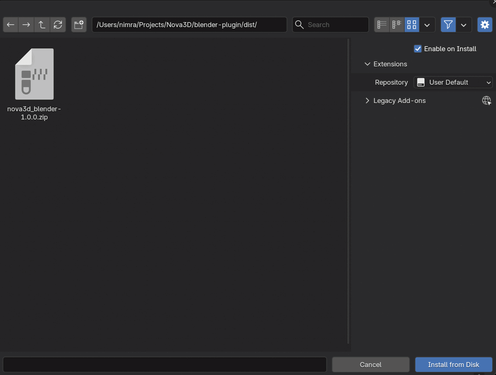
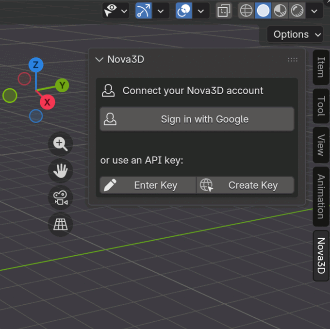
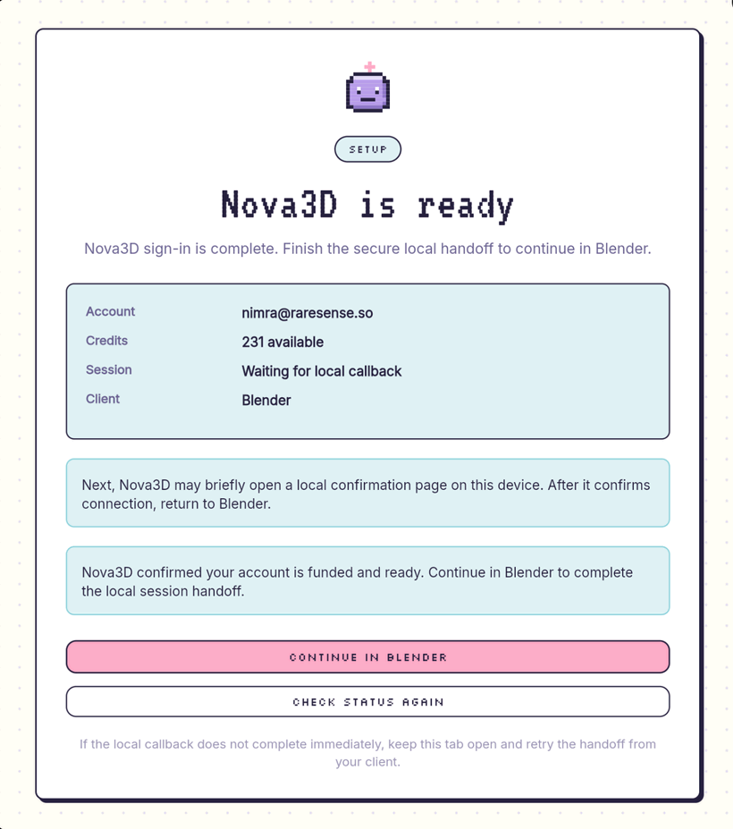
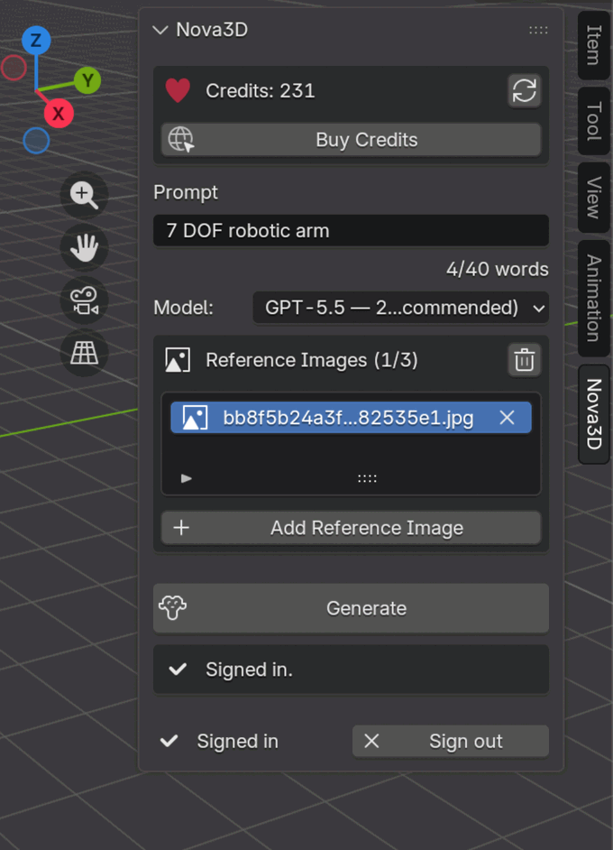

# Nova3D — Blender Add-on

Generate **part-structured 3D models** from a text prompt (and optional reference
images) right inside Blender. Each model imports as named, separately-editable
meshes with materials and a UV atlas — plus the Blender Python that built it.
Powered by the hosted Nova3D service. Use Nova3D Credits, an Anthropic key for
Claude Fable 5, or an OpenAI key for GPT-5.6 Sol and GPT-5.5.

> Works in Blender **3.6 → 5.x** (tested on 5.1). Nothing else to install.

## 1. Download the add-on

Open the [**Releases page**](https://github.com/RareSense/Nova3D/releases) and,
under the newest release's **Assets**, download **`nova3d_blender-1.2.0.zip`**.
Leave it zipped — Blender installs the `.zip` as-is.

## 2. Install it in Blender

1. Open Blender. In the top menu bar, click **Edit → Preferences**.
2. In the window that opens, click **Get Extensions** in the left-hand list.
3. At the **top-right**, click the small **▾ arrow** (next to the funnel icon) and
   choose **Install from Disk…**.
4. Find your `nova3d_blender-1.2.0.zip`, click it, then click **Install from Disk**.
   It installs *and* switches on automatically. If asked, allow the *Network* and
   *Files* permissions.

   

5. Still in Preferences, click **System** in the left list and tick
   **Allow Online Access** (the add-on needs this to reach Nova3D). Close Preferences.

## 3. Open the Nova3D panel

Press **N** in the 3D viewport to open the sidebar, then click the **Nova3D** tab.

## 4. Sign in

Click **Sign in with Google**. Your web browser opens — sign in there. When the page
says **"Nova3D is ready"**, switch back to Blender; you're now connected.

> No Google account? Click **Enter Key** instead and paste a Nova3D API key
> (create one at <https://app.nova3d.xyz/api-key>).




## 5. Generate

1. Type what you want in the **Prompt** box (e.g. *"7 DOF robotic arm"*).
2. In **Generation access**, choose:
   - **Nova3D Credits** for hosted billing; or
   - **My API Key** to add a direct Anthropic/OpenAI key.
3. For a provider key, follow the in-panel setup links, add at least **$20** to
   the provider account, enable the OpenAI models when applicable, then click
   **Test key & model access**. Only models that pass the live check appear in
   the picker.
4. Pick a **Model**. Hosted choices are Claude Opus 5, Claude Fable 5,
   GPT-5.6 Sol, and GPT-5.5. Direct-key choices are Claude Fable 5 through
   Anthropic and GPT-5.6 Sol/GPT-5.5 through OpenAI.
5. *(Optional)* Click **Add Reference Image** — up to 3.
6. Click **Generate** and wait. Blender stays usable while it runs.



When it finishes, the model appears in the viewport and its `code.py` opens in
Blender's Text Editor. Everything is also saved on your computer at
`~/Nova3D/<timestamp>_<name>/`:

```
model.glb   ·   code.py   ·   uvs/   ·   meta.json
```

## Good to know

- **Nova3D Credits** power hosted generation. Direct-key generation uses zero
  Nova3D Credits and the selected provider bills your account.
- Hosted and provider-key generation use the same construction prompts, repair
  loop, Blender execution, and final validation. On reference-image runs, the
  selected direct model also performs the image analysis because an Anthropic
  or OpenAI key cannot call Nova3D's hosted caption route.
- Provider keys are stored in Blender's user preferences, not in `.blend`,
  project metadata, history, logs, or pending-generation files. A selected key
  is sent to Nova3D's BYOK workflow so the hosted toolkit can call its provider.
- Ordinary provider keys do not expose a trustworthy cash balance. The `$20`
  funding checkbox is therefore a user confirmation, not a balance claim. The
  add-on also lists the exact available models and makes a tiny real request at
  setup and immediately before every generation. That catches rejected keys,
  disabled models, exhausted credits, and spend limits before the long run.
- A successful preflight proves the account can serve the model at that moment;
  it cannot guarantee the balance will cover an unusually long generation.
  If funds run out during final visual review, Nova3D keeps the valid GLB.
- If a run is interrupted, Nova3D's backend keeps working and the run remains in
  the web app. Blender preserves a resumable pointer; reopen the panel and click
  **Resume**, or click **Open App**. **Stop waiting in Blender** also detaches
  without falsely claiming to cancel the backend run.
- If Nova3D can't be reached, the panel shows an **unreachable** notice with a
  **Retry** button — no failed generation, just try again when you're back online.
- The add-on checks for a newer version on startup and shows a **Download update**
  link when one exists (also under **Preferences → Add-ons → Nova3D**). It does
  not silently install code. Download the new release zip and use **Install from
  Disk…** again; Blender replaces the installed version, so you do not need to
  uninstall it first.
- Don't see colours? Materials only show in **Material Preview**; the add-on
  switches to it for you. Press **Alt + H** to un-hide anything it tucked away.
- Change the output folder or self-host URLs in
  **Edit → Preferences → Add-ons → Nova3D**.

## Build from source (developers)

```bash
git clone https://github.com/RareSense/Nova3D.git
cd Nova3D/blender-plugin
bash build.sh            # creates dist/nova3d_blender-1.2.0.zip
```

Then install that zip via step 2 above.

MIT © RareSense.
